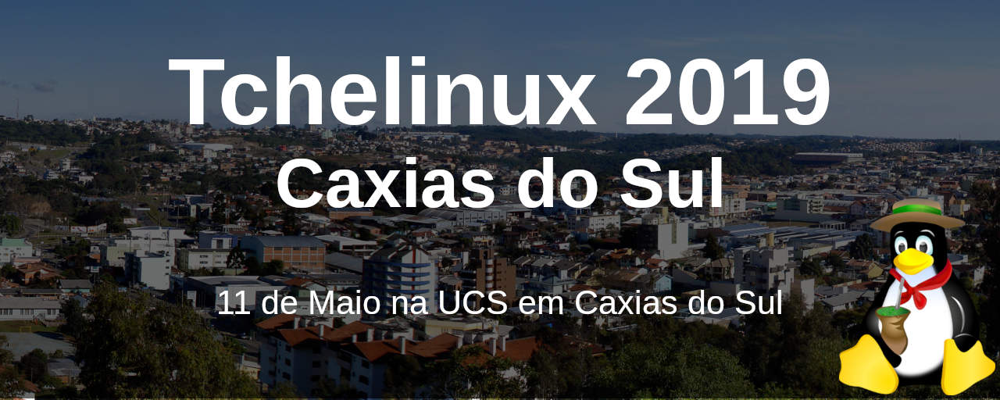
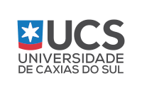
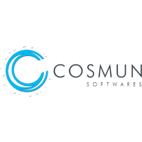
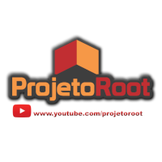

## Sobre

O grupo de usuários de Software Livre Tchelinux, em parceria com a [Universidade de Caxias do Sul](https://www.ucs.br/), tem o prazer de convidar a comunidade para participar do evento que ocorrerá no dia **11 de Maio de 2019 a partir das 8:30h** na UCS em Caxias do Sul.

## Inscrições

 O evento tem **entrada franca**, porém os participantes são encorajados a doar 2kg de alimentos não perecíveis (exceto sal), que são doados a instituições de caridade da região. Os alimentos são recebidos no momento do credenciamento.

<a href="https://forms.gle/B1GtM7SmrJoBBcb86" target="_blank"><b>Clique aqui para fazer sua inscrição!</b></a>

## Certificados

Serão fornecidos certificados digitais para os participantes do evento, que confirmaram sua presença. Para obtê-los, você deverá utilizar o email fornecido na sua inscrição para o evento.

**Importante:** Não esqueça de confirmar sua presença no credenciamento.

## Programação

| 
 Horário 
 | 
 Sala 1   Desenvolvimento 
 | 
 Sala 2   DevOps e SysAdmin  
 | 
 Sala 3   IoT, Comunidade e Segurança  
 |
|:--------------------------:|:-----------------------:|:-----------------------:|:-----------------------:|
| **08:30** <td colspan=4>
**Credenciamento**
 |
| **09:00** <td colspan=4>
**Abertura**  Todo o público     Equipe Tchelinux    
 |
| **9:30** |  [**Como aprender python partindo do zero usando apenas recursos online e livros**](#Como_aprender_python_partindo_do_zero_usando_apenas_recursos_online_e_livros)   Principiante   Adriano Margarin |  [**Administrando PostgreSQL com PowerShell**](#Administrando_PostgreSQL_com_PowerShell)   Principiante   Rodrigo Crespi |  [**Sistemas Embarcados e Buildroot**](#Sistemas_Embarcados_e_Buildroot)   Principiante   Renato Severo | 
| **10:20** |  [**Desenvolvendo Jogos com Pygame**](#Desenvolvendo_Jogos_com_Pygame)   Principiante   Rafael Guterres Jeffman |  [**oVirt uma solução de virtualização distribuída opensource**](#oVirt_uma_solução_de_virtualização_distribuída_opensource)   Principiante   Daniel Lara |  [**Micropython para IoT**](#Micropython_para_IoT)   Intermediário   Fabio Utzig | 
| **11:10** |  [**Introdução ao Spring Boot MVC no Java Servlet Stack com a aplicação Pet Clinic**](#Introdução_ao_Spring_Boot_MVC_no_Java_Servlet_Stack_com_a_aplicação_Pet_Clinic)   Principiante   Marco Aurélio Souza Mangan |  [**Poder do Ansible**](#Poder_do_Ansible)   Intermediário   Marcus Burghardt |  [**Como ter sucesso com software livre**](#Como_ter_sucesso_com_software_livre)   Principiante   Cristiano dos Santos Diedrich | 
| **12:00** <td colspan=4>
**Intervalo para Almoço**
 |
| **13:30** |  [**Uma Não-Gentil Introdução ao Stream Processing**](#Uma_Não-Gentil_Introdução_ao_Stream_Processing)   Intermediário   Julio Biason |  [**DevOps - Passado, Presente e Futuro**](#DevOps_-_Passado,_Presente_e_Futuro)   Intermediário   Cristiano dos Santos Diedrich |  [**A tecnologia no futuro e nas mãos de quem ela estará**](#A_tecnologia_no_futuro_e_nas_mãos_de_quem_ela_estará)   Principiante   Jaqueline Trevizan, Neiva Kuyven e Alexandra Cemin | 
| **14:20** |  [**Desenvolvendo APIs com PHP7 e Zend Expressive**](#Desenvolvendo_APIs_com_PHP7_e_Zend_Expressive)   Intermediário   Er Galvão Abbott |  [**Iniciando com Kubernetes**](#Iniciando_com_Kubernetes)   Principiante   Cristhian Bicca |  [**Implementando um Ransomware em Shell Script**](#Implementando_um_Ransomware_em_Shell_Script)   Intermediário   Edson Dino Salvati |
| **15:10** <td colspan=4>
**Coffee-Break**
 |
| **15:40** |  [**Flutter - Uma nova era**](#Flutter_-_Uma_nova_era)   Principiante   Vilson Dauinheimer |  [**Disponibilização de Serviços em IPv6 na UCS - Um Caso Prático**](#Disponibilização_de_Serviços_em_IPv6_na_UCS_-_Um_Caso_Prático)   Intermediário   Jerônimo Zucco |  [**Ferramentas OpenSource Essenciais Para Um Ethical Hacker**](#Ferramentas_OpenSource_Essenciais_Para_Um_Ethical_Hacker)   Intermediário   Mateus Buogo | 
| **16:20** |  [**Otimização de imagens para sites**](#Otimização_de_imagens_para_sites)   Principiante   Perceu Bertoletti |  [**Produção de textos com Latex**](#Produção_de_textos_com_Latex)   Principiante   Samuel Francisco Ferrigo |  [**Pwned! Meu site foi invadido**](#Pwned!_Meu_site_foi_invadido)   Intermediário   Fabio Beneditto |
| **17:10** <td colspan=4>
**Encerramento**  Todo o público     Equipe Tchelinux    
 |

## Palestras

### Como aprender python partindo do zero usando apenas recursos online e livros 

Nesta apresentação veremos como aprender Python partindo do zero usando apenas recursos online e livros.

### Adriano Margarin 

[Adriano Margarin](https://twitter.com/adrianomargarin) é Desenvolvedor WEB com 8+ anos de experiência utilizando as tecnologias Python e Django.

### Administrando PostgreSQL com PowerShell 

Nesta sessão irei apresentar os comandos básicos de módulos de administração de bancos de dados PostgreSQL utilizando o Powershell em ambiente Windows e Linux.

### Rodrigo Crespi 

[Rodrigo Crespi](https://sqlcrespi.com) é MVP Data Platform, MCT, MCSE, MCSA, MCIT, MCDBA e MCP em SQL Server, possui outras certificações em .NET Framework, Dynamics CRM e etc. Iniciou trabalhando com MySQL 3, PostgreSQL 7 e SQL Server 6.5 na época como desenvolvedor e logo direcionou a sua carreira para a área de administração de bancos de dados. 

Atualmente é Sócio da CrespiDB – Soluções em Plataformas de Dados direciona seu foco na administração de servidores SQL Server, PostgreSQL em ambientes on-premises e cloud, além de professor universitário na Uniftec – Caxias do Sul.

Autor de diversos artigos publicados em sites e revistas sobre SQL Server e engenharia de software, mantêm o canal SQLCrespi no Youtube, o blog SQLCrespi. Também dedica-se ao SQL Server RS PASS Chapter Leader do grupo de profissionais em SQL Server do Rio Grande do Sul.

Em seu tempo livre aprecia jogos FPS, seriados, viagens e cafés. Além de, estudar diversas tecnologias, como PowerShell, Bash, C++, etc. 

### Sistemas Embarcados e Buildroot 

Buidroot é uma ferramenta para automação do processo de geração de um sistema Linux para dispositivos embarcados. O objetivo da palestra é dar uma visão geral dos componentes de um sistema embarcado que utiliza Linux e como gerar um sistema Linux embarcado com o Buildroot.

### Renato Severo 

[Renato Severo](https://linkedin.com/in/renatossevero/) é Engenheiro de Computação pela Unipampa Bagé. Especialista em Sistemas Embarcados pela UERGS Guaíba. Desenvolvedor de Sistemas Embarcados na DATACOM em Eldorado do Sul.

### Desenvolvendo Jogos com Pygame 

Jogar todo mundo joga. Programar, todo mundo pode. Jogar todo mundo treina. Programar, nem tanto. Mas para jogar é necessário que alguém desenvolva suas habilidades de programador. Nesse bate papo, porque ninguém mais tem paciência para palestras, será apresentada uma forma divertida de desenvolver a programação e conhecer a linguagem Python, construindo jogos, utilizando a biblioteca Pygame e ferramentas open source para desenvolver um jogo.

### Rafael Guterres Jeffman 

[Rafael Guterres Jeffman](https://github.com/rafasgj) é fotógrafo, impressor e professor universitário. Leciona as disciplinas de algoritmos, estruturas de dados e desenvolvimento de jogos. Colaborou por anos com a distribuição GoboLinux. Entre seu projetos atuais, está um sistema de gerenciamento de ativos digitais multiplataforma, open source.

### oVirt uma solução de virtualização distribuída opensource 

Nesta apresentação conheceremos o oVirt, uma poderosa solução de código aberto de virtualização. 

### Daniel Lara 

[Daniel Lara](https://twitter.com/danniellara) trabalha como Sysadmin e nas horas de folgas contribui com o Projeto Fedora.

### Micropython para IoT 

Micropython é uma implementação do zero da linguagem Python construída para ser utilizada em microcontroladores. Ela trás o Python, que é uma linguagem fácil, e poderosa para o mundo dos sistemas embarcados, tornando mais acessível a criação de dispositivos por todos. Na apresentação demostrarei como usá-la para desenvolver seu produto, comparando com Python oficial e porque não com Arduino!

### Fabio Utzig 

[Fabio Utzig](https://github.com/utzig) é Desenvolvedor de software a quase 20 anos, fã de código aberto, focado em sistemas embarcados, foi mantenedor do RTOS aberto ChibiOS/RT desde 2011, atualmente trabalhando em todo ecosistema ao redor do SO para IoT Apache Mynewt.

### Introdução ao Spring Boot MVC no Java Servlet Stack com a aplicação Pet Clinic 

Uma aplicação Web é um sistema distribuído de alta complexidade. Diversos frameworks de aplicação foram propostos para simplificar a tarefa de desenvolver esse tipo de aplicação. O Spring é um dos frameworks mais influentes dentro e fora do ecossistema Java. Sua implementação em código aberto adota conceitos inovadores como programação orientada a aspectos, programação por convenção e injeção de dependências. Além disso, o framework incentiva e divulga práticas como teste e compilação automáticos. A aplicação Spring Pet Clinic é um arquétipo que apresenta diversas soluções para compor uma aplicação Web contemporânea. A palestra é dirigida para iniciantes. Serão apresentados conceitos de programação e comentados guias selecionados disponíveis no site da spring.io. Ao final da palestra o participante deve ser capaz de compreender, implantar e alterar o código da aplicação Pet Clinic. 

### Marco Aurélio Souza Mangan 

[Marco Aurélio Souza Mangan](https://github.com/masmangan) é Graduado (1995) e Mestre (1998) em Ciência da Computação pelo Instituto de Informática/UFRGS e doutorado em Engenharia de Sistemas e Computação pelo PESC/UFRJ (2006). Atualmente é professor da Escola Politécnica/PUCRS. Os principais interesses são ensino, teoria e prática de desenvolvimento de software.

### Poder do Ansible 

Mostrarei os conceitos essenciais de Ansible, com algumas demonstrações do que ele pode fazer já com alguns ambientes mais complexos e como podemos aumentar a eficiência do nosso trabalho nesse mundo de DevOps.

### Marcus Burghardt 

[Marcus Burghardt](https://www.linkedin.com/in/marcusburghardt/) é Tecnologo em Redes de Computadores, especialista em Segurança da Informação com cerca de 15 anos de experiência em Testes de Invasão, Engenharia Social, Contra-espionagem, localização e correção de vulnerabilidades em softwares e aplicações, elaboração de políticas de Segurança da Informação e Treinamentos Avançados de Segurança e Infraestrutura.

Certificações em diversas tecnologias, nas Áreas de Segurança da Informação, Redes, Virtualização, Cloud, Midleware, Governança de TI, Linux, Windows, DevOps, Gerencimento de Infraestruturas em larga escala, Performance Tuning, Hardening, etc. Experiência prática e aprofundada em todas essas áreas.

Instrutor e examinador oficial da Red Hat no Brasil, professor em cursos de Pós-Graduação em Segurança da Informação e Diretor da MBSEC Segurança da Informação

### Como ter sucesso com software livre 

Ao longo de sua vida, quantas vezes você sentiu que havia conquistado o sucesso?  Agora pense, quantas vezes você pensou em desistir?  O objetivo dessa apresentação é trazer uma reflexão sobre o que é sucesso realmente e onde software livre pode ajudar você nessa caminhada.

### Cristiano dos Santos Diedrich 

[Cristiano dos Santos Diedrich](https://www.mundodocker.com.br) é entusiasta Open Source, se meu principal foco é ir atrás de ideias novas e torna-las realidade através de soluções simples e eficientes. É organizador do Meetup Docker Porto Alegre, Meetup DevOps/SRE Porto Alegre e DevOpsDays Porto Alegre.

### Uma Não-Gentil Introdução ao Stream Processing 

Stream Processing é uma área nova, irmã mais nova do Batch Processing e ambos são utilizados para geração de dados "read ready" em Big Data. Nesta apresentação, iremos ver como batch processing e stream processing se encaixam no processamento de big data e algumas dicas de como um pipeline deve ser construído.

### Julio Biason 

[Julio Biason](https://functional.cafe/@juliobiason) é Desenvolvedor desde os 12 anos e trabalhou com stream processing durante um ano.

### DevOps - Passado, Presente e Futuro

A vida de quem trabalha com tecnologia muda constantemente, a cada dia surgem mais e mais soluções, metodologias e formas de melhorar o nosso trabalho. DevOps é um dos diversos termos que se destacam nos últimos anos, então nada melhor do que conversarmos um pouco sobre ele, entender como ele pode ajudar as empresas atualmente e pensarmos juntos em como será não só DevOps mas sim, nossa vida com DevOps.

### Cristiano dos Santos Diedrich 

[Cristiano dos Santos Diedrich](https://www.mundodocker.com.br) é entusiasta Open Source, se meu principal foco é ir atrás de ideias novas e torna-las realidade através de soluções simples e eficientes. É organizador do Meetup Docker Porto Alegre, Meetup DevOps/SRE Porto Alegre e DevOpsDays Porto Alegre. 

### A tecnologia no futuro e nas mãos de quem ela estará 

A tecnologia de hoje não é a mesma que existia no passado e também não será a mesma no futuro. Sobre o futuro, sabemos que com o avanço dela novas profissões irão surgir, essas novas profissões, oriundas de demandas ainda não existentes, são fomentadas no presente, à partir da escolha das competências necessárias para os futuros profissionais. As junções das habilidades desenvolvidas em diversas áreas de conhecimento tornará os profissionais aptos a exercerem funções ainda não existentes, seja emocionalmente, intelectualmente ou tecnicamente, para assim estar mais preparado para o mundo do trabalho. Falaremos de projetos que já estão em andamento para que esses novos profissionais estejam aptos para este futuro promissor tecnológico.

### Jaqueline Trevizan

[Jaqueline Trevizan](https://www.linkedin.com/in/jaquelinetrevizan) cursa Análise e desenvolvimento de sistemas na Uniftec, e é apaixonada por tecnologia. Apoia e incentiva o ensino de programação para crianças e adolescentes e a inclusão da mulher na área de TI.

### Neiva Kuyven

[Neiva Kuyven](http://lattes.cnpq.br/6429639409221087) é Doutoranda em Informática na Educação na UFRGS- Universidade Federal do Rio Grande do Sul. Mestre em Ciências da Computação pela Universidade Federal de Santa Catarina (2002), Graduação em Informática pela Universidade Regional do Noroeste do Estado do Rio Grande do Sul (1996) . Coordenadora do Curso de Bacharelado em Engenharia de Computação e do Curso Superior de Tecnologia em Análise e Desenvolvimento de Sistemas do Centro Universitário UNIFTEC. Atua como professora nos cursos que coordena e também nos cursos Superiores de Redes de Computadores e Gestão da Tecnologia.  Líder do grupo de pesquisa de Inteligência Artificial do UNIFTEC.

### Alexandra Cemin 

[Alexandra Cemin](http://lattes.cnpq.br/1958688202287600) possui Licenciatura Plena em Matemática e Física (UCS), especialista em Psicopedagogia em Gestão Organizacional e Psicopedagogia Clínica (UNILASALLE), com ênfase em dificuldades de aprendizagem matemática, mestrado em Educação (UNILASALLE) e doutoranda em Engenharia e Ciência dos Materiais (UCS). Atua como palestrante nas áreas de educação, é assessora pedagógica da EAD no Uniftec, docente de cálculo nas engenharias, docente de física na educação de jovens e adultos modalidade à distância no SESI/FIERGS e desenvolvedora de conteúdos, ministra disciplinas em cursos de pós-graduação. Pesquisadora na área de inteligência artificial e metodologias de ensino e coordenadora de projetos em robótica e programação para crianças e adolescentes. Experiência como: Coordenadora Pedagógica no Ensino Superior da rede Ftec Faculdades, docente de matemática e física no ensino básico, técnico, jovens e adultos (EAD) e superior, instrutora de robótica educacional e coordenadora de projetos.

### Desenvolvendo APIs com PHP7 e Zend Expressive 

Nesta palestra serão discutidos conceitos envolvidos na criação de uma API, além de exemplos práticos e dicas de ferramentas para a criação de uma API utilizando-se PHP7 e Zend Expressive

### Er Galvão Abbott 

[Er Galvão Abbott](https://www.galvao.eti.br/) é Presidente (2012 – 2017) da ABRAPHP – Associação Brasileira de Profissionais PHP
Diretor da PHP Conference Brasil. Evangelista e Contribuidor para a Linguagem atua como Zend Framework Evangelist para o ZTeam, da Zend
Embaixador Fedora LATAM. É Professor Convidado (Especialista) de Pós-Graduação (PR e SC). 25+ anos desenvolvendo sistemas e aplicações com interface web, 20+ destes com PHP e 12+ com Zend Framework. É Palestrante em eventos nacionais e internacionais e Professor de cursos presenciais e a distância.

### Iniciando com Kubernetes 

Nesta palestra vamos explicar o que é o Kubernetes, como ele funciona, seus principais componentes e porque utilizá-lo. Vamos realizar a instalação e configuração de um cluster simples para rodar algumas aplicações.

### Cristhian Bicca 

[Cristhian Bicca](https://www.mundodocker.com.br) é Entusiasta e praticante da cultura DevOps, acredito que a melhor forma de aprender é compartilhando o conhecimento, então procuro sempre participar de eventos tanto como palestrante como também assistir, quando não estou trabalhando procuro passar o conhecimento através do meu blog.

### Implementando um Ransomware em Shell Script 

Demonstração prática do funcionamento de um ransomware utilizando a linguagem bash para implementação do malware e do "Command and Control" (C&C). Serão também explicados conceitos básicos das criptografias simétrica e assimétrica e o porquê da utilização das duas.

### Edson Dino Salvati 

[Edson Dino Salvati](https://www.linkedin.com/in/esalvati/) é Diretor de Pesquisa e Desenvolvimento da Integrasul. Bacharel em Ciência da Computação pela UCS. Dos 22 anos de carreira, 18 foram focados em Linux e OSS.

### Flutter - Uma nova era 

Nesta apresentação veremos a história do Flutter e teremos uma demostração de como criar um aplicativo simples usando ele.

### Vilson Dauinheimer 

[Vilson Dauinheimer](https://github.com/Bwolfnoob) é Programador C# a 5 anos, trabalho com desenvolvimento mobile a pelo menos 2 anos, começando com Xamarin, e agora com Flutter desde Dezembro com o lançamento da versão 1.0

### Disponibilização de Serviços em IPv6 na UCS - Um Caso Prático 

O objetivo dessa apresentação é falar sobre como a Universidade de Caxias do Sul disponibilizou os seus serviços web em rede IPv6,  o caminho utilizado e as dificuldades encontradas durante essa implementação.

### Jerônimo Zucco 

[Jerônimo Zucco](https://twitter.com/jczucco) é Bacharel em Ciência da Computação pela Universidade de Caxias do Sul e Pós-Graduado em Gerência e Segurança de Redes de Computadores também pela UCS. Certificado CISSP (Certified Information Systems Secure Profissional), membro do projeto OWASP (Open Web Application Security Project) desde 2010. Já palestrou em diversos eventos sobre o tema segurança de sistemas: You Shot The Sheriff, FISL, Tchelinux, Python Brasil, ABIN, PoaSec, GTS e OWASP.

### Ferramentas OpenSource Essenciais Para Um Ethical Hacker 

Nesta palestra teremos uma visão geral sobre ferramentas básicas e essenciais opensource de ethical hacker.

### Mateus Buogo 

[Mateus Buogo](https://www.linkedin.com/in/mateus-buogo-b0084917/) é Grauado em Redes de Computadores pelo Centro Universitário Faculdade de Tecnologia - Caxias do Sul(2011) e especialização em MBA Administração de TI pela Universidade do Vale do Rio dos Sinos(2013). Atualmente é Professor do Centro Universitário Faculdade de Tecnologia e Analista de Suporte. Tem experiência na área de Segurança da Informação e Infraestrutura de Rede.

### Otimização de imagens para sites 

Nesta apresentação veremos como otimizar imagens para Web usando Python e flask para reduzir o tempo de carregamento de sites.

### Perceu Bertoletti 

[Perceu Bertoletti](https://perceu.github.io/me/) é Desenvolvedor Web com experiência em Python e PHP, entusiasta de Linux e Open Source é ativo em algumas comunidades.

### Produção de textos com Latex 

O objetivo da palestra é mostrar os recursos que o sistema Latex oferece para produção e formatação de artigos científicos, trabalhos de conclusão de curso e outras produções textuais, especialmente acadêmicas.

### Samuel Francisco Ferrigo 

[Samuel Francisco Ferrigo](http://lattes.cnpq.br/0533228733592354) é Mestre em Computação Aplicada pela Unisinos. Possui MBA em Gestão de TI pela UCS. Tecnólogo em Redes de Computadores pela UniFTEC. Trabalha com TI há quase 20 anos.

### Pwned! Meu site foi invadido 

Todos sabem que a pressa é inimiga da perfeição, mas não adianta deixar aspectos simples de segurança para depois. Veremos como identificar vulnerabilidades de SQL Injection em aplicações PHP, que são encontradas na maioria dos web sites.

### Fabio Beneditto 

[Fabio Beneditto](https://about.me/fabiobeneditto) é Desenvolvedor Web, Old School Nerd, simpatizante de F/OSS, segurança da informação e comunidades em geral. Voluntário Tchelinux desde 2016, e praticante de #mototerapia. 

## Local

> **Universidade de Caxias do Sul**
> Bloco 46 (Campus Sede)
> Rua Ernesto Graziotin, 1066
> Caxias do Sul - RS

     <iframe src="https://www.google.com/maps/embed?pb=!1m18!1m12!1m3!1d2929.752717288708!2d-51.14953390707662!3d-29.16223288154213!2m3!1f0!2f0!3f0!3m2!1i1024!2i768!4f13.1!3m3!1m2!1s0x951ebcf1db2c22cb%3A0x45140fd1d48bce98!2sBloco+46!5e0!3m2!1sen!2sbr!4v1555982994611!5m2!1sen!2sbr" width="600" height="450" frameborder="0" style="border:0" allowfullscreen></iframe>

## Apoio

### Institucional

### Patrocínio

### Divulgação

